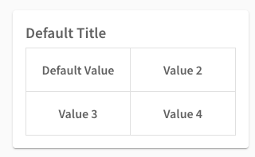
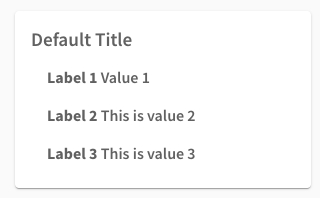

**********
Primitives
**********

.. contents::
    :depth: 3

jsonpath
########

jsonpaths are used extensively throughout workflows for object lookups. Full documentation can be found `here <https://goessner.net/articles/JsonPath/>`_.

A quick primer for the sake of expediency: a jsonpath is a representation for a lookup in a structured object. For instance, given the object::

    {"outer": {"inner": {"value": "Hello"}}}

the lookup ``$.outer.inner.value`` returns ``"Hello"``. Jsonpath allows for filtering, this is useful for defining many things within workflows so we strongly suggest that you take a look at the `full docs <https://goessner.net/articles/JsonPath/>`_.

Schema
######

Json schemas forming the valid prototypical structures for workflow json.

.. _task_objects:

Tasks
#####

Tasks are actions to be performed by the client and take the form of specific objects types identified by the ``type`` keyword.

.. important::

    * All task names should be unique within a flow (remember, :ref:`subflows <glossary>` are themselves a flow).
    * Flow task names should be unique within a workflow.

Schema
******

.. jsonschema:: ../../src/core/schema/tasks/task.json

.. _flow_task:

Flow
****

Flow tasks are the base task for a workflow, they act as context scopes containing tasks to be executed within that scope.

Returning values from the context scope to the flow above is done by setting the ``result`` which is built from the `result_keys`. `result_keys` are a list of objects which of the form  ``{"key": "$.source", "result_key": "$.destination"}`` or ``{"result": "x", "result_key": "$.destination"}``, this form allows for renaming values and the restructuring of data to build the ``result`` object.

.. note:: The ``result`` object should copied then updated by parsing the ``result_keys`` this allows meta-data/debug-info to be set by the provider of the workflow.

The `result` is either placed at ``destination_path`` or if ``destination_path = False`` the ``result`` is merged directly into the parent context, that is the context of the flow on which this is a task.

.. note:: ``destination_path = False`` means merge result with the above context, whereas ``destination_path = None`` (the default value) means no destination path is set, this may be used for a flow or loop which does not define a ``result`` i.e. has no result keyword

.. warning:: Subflows (a flow within another flow) can see the context of the flow above them. However, only state which is modified via the result objects will persist after leaving the flow.

A flow can be as simple as a list of tasks to be performed, a :ref:`while_loop_task` or a :ref:`for_loop_task`. The looping tasks build a list of `result` objects if one is defined.

.. todo:: Having ``destination_path = False`` for loops should raise an error as this undefined behavior.

.. warning:: Within a loop, the context is maintained in between iterations for the duration of the loops execution. If you wish to have values cleared down between iterations add an update task to the start of the loop to initialize your values.

.. _while_loop_task:

While loop
----------

Repeat the flow tasks until a condition fails. The condition is a set of validators, when any of these validators fail the loop will exit at the end of its current iteration, the loop is in effect broken and the result is inserted into the context above. In order to leave the loop partway through an iteration an :ref:`event <event_task>` with an action of type break can be used

.. _for_loop_task:

For loop
--------

Repeat the flow tasks for a given list of objects. At each iteration the object at the current index of the list is merged into the context, this flows tasks are then evaluated. Once the list of objects has been exhausted, the loop will exit at the end of its current iteration and the result will be inserted into the context above. For example assuming the ``iterable_path="$.for_loop_list"`` and the context begins as:

.. code-block::

    {
        "not_affected": "MC Hammer",
        "value": "a",
        "for_loop_list": [{"value": 1}, {"value": 2}]
    }

then in the 1st Iteration the context will look like:

.. code-block::

    {
        "not_affected": "MC Hammer",
        "value": 1,
        "for_loop_list": [{"value": 1}, {"value": 2}]
    }

and during the 2nd Iteration:

.. code-block::

    {
        "not_effected": "MC Hammer",
        "value": 2,
        "for_loop_list": [{"value": 1}, {"value": 2}]
    }

then after, if no ``result`` was set, then the context returns to its former state:

.. code-block::

    {
        "not_effected": "MC Hammer",
        "value": "a",
        "for_loop_list": [{"value": 1}, {"value": 2}]
    }

There is no requirement for each iteration object to have the same type(structure). Although you have to deal with the consequences if you choose for them to differ.

Schema
------

.. jsonschema:: ../../src/core/schema/tasks/flow.json

.. _screen_task:

Screen
******

Screen tasks are the sole task type used to display components to the user (excluding status messages which can be presented by other tasks, although they will be shown on the next screen task presented to the user).

Schema
------

.. jsonschema:: ../../src/core/schema/tasks/screen.json

.. _jsonrpc_task:

JSON RPC
********

Are remote procedure calls. ``payload_paths`` and ``payload`` are analogous to ``result_keys`` and ``result`` in the :ref:`flow task <flow_task>` in that the payload sent to endpoint defined by ``url`` is constructed by copying the ``payload`` object and ``payload_paths`` are used to update the payload sent. The expectation is that the endpoint will respond with json stored in the ``response_path``.

Schema
------

.. jsonschema:: ../../src/core/schema/tasks/jsonrpc.json

.. _wait_task:

WAIT
****

Similar to a procedure call. ``payload_paths`` and ``payload`` are analogous to ``result_keys`` and ``result`` in the :ref:`flow task <flow_task>` in that the payload sent to endpoint defined by ``url`` is constructed by copying the ``payload`` object and ``payload_paths`` are used to update the payload sent. The expectation is that the endpoint will respond with json stored in the ``response_path``.
Extra parameters given are conditions (list of validators) and timeout (expressed in microseconds). The given url will keep being polled until the validator(s) in the conditions resolve.

Schema
------

.. jsonschema:: ../../src/core/schema/tasks/wait.json

.. _update_task:

Update
******

Update tasks are used to change values in the context. An update task itself may contain multiple distinct updates to perform, these essentially act as subtasks. The subtasks come in three major forms, dictated by the keywords used in their invocation as shown below:

1. updating the context with a raw value (keyword - "result"):

.. code-block::

    {"result": "x", "result_key": "$.destination"}

2. renaming a context value (keyword - "key"):

.. code-block::

    {"key": "x", "result_key": "$.destination"}

3. creating a new value using a string template (key word - "template"):

.. code-block::

    {"template": "{$.value}{$.another}", "result_key": "$.destination"}

There are also extra flags ``append`` and ``extend``, which are mutually exclusive, they act by modifying the above major cases, updating a destination which must be a list. Extend and append are used with their conventional meanings i.e. extend will concatenate lists and append will add a value to the end of a list. As such the result for extend needs to be a list and the result for append needs to be a value.

Schema
------

.. jsonschema:: ../../src/core/schema/tasks/update.json

.. _redirect_task:

Redirect
********

Redirect tasks switch the workflow to that found at the url provided.

Schema
------

.. jsonschema:: ../../src/core/schema/tasks/redirect.json

.. _condition_task:

Condition
*********

Selects a task to switch to based on whether a condition is true or false. This requires the flow and name of the task we wish to select to be specified, using a :ref:`TaskTarget container<target_task_container>`.

.. warning:: Jumps are only allowed to the same flow or ancestors of the flow.

Schema
------

.. jsonschema:: ../../src/core/schema/tasks/condition.json

.. _set_domain_task:

Domain param
************

Set a value in the local store which is added to the url of :ref:`JSONRPC <jsonrpc_task>` calls.

Schema
------

.. jsonschema:: ../../src/core/schema/tasks/set_domain_param.json

.. _clear_domain_task:

Clear domain params
*******************

Clear values set using :ref:`Domain Param <set_domain_task>`.

Schema
------

.. jsonschema:: ../../src/core/schema/tasks/clear_domain_params.json

.. _event_task:

Event
*****

An event task can be used to break loops ...

.. todo:: Add payload_paths

Schema
------

.. jsonschema:: ../../src/core/schema/tasks/event.json

.. _validator_objects:

Validators
##########

Check the truth-y-ness of a condition, this is used in a variety of ways throughout workflows:

* checking field inputs are valid
* conditions in a :ref:`condition task <condition_task>` or :ref:`while loop <while_loop_task>`
* all :ref:`tasks <task_objects>` and :ref:`components <component_objects>` have optional preconditions, the evaluation of which decide if a task is run or a component is displayed

When defining a validator there must be a function to be evaluated in the client, this is represented by the string in the ``type`` attribute. For field validation ``value_key`` is ignored. For others ``validator_value`` is a raw comparison value passed to the validator, whereas ``validator_key`` is a jsonpath used to lookup the comparison value in the context. The ``valid_when`` flag allows you to switch the truth-y-ness of the comparison, i.e. whether it's valid when true or when false.

JSON Validators
##########

Check the truth-y-ness of a condition, this is used in Input components to trigger or not a JSON RPC call on blur of input field.
JSON Validators are a list of one or more than one validators and are calculated in same way as Validators.
The way it is handled on client, should have a message template,
practically it means that if validator returns False on client it will send an error message which will not trigger the endpoint call.
Inside the endpoints shouldn't raise errors, but skip them as these endpoint are used to update context or other fields.

Schema
******

.. jsonschema:: ../../src/core/schema/validator.json

.. _component_objects:

Components
##########

Components are screen elements to be interacted with and viewed by the user. Components are split into two parts: the base component and the component look up. The base component is extracted into :ref:`components key <basic_structure>` in the workflow, this is then used by the component look up. As such, components with the same name are required to have the same values, otherwise an error is thrown. As with task components, these have preconditions which dictate if they are shown.

Schema
******

.. jsonschema:: ../../src/core/schema/components/component.json

.. jsonschema:: ../../src/core/schema/common/component_lookup.json

Text box
-----------

A textbox for providing general information to a user. Accepts a Mark Down formatted string and an alignment parameter.

Schema
^^^^^^

.. jsonschema:: ../../src/core/schema/components/textbox.json

Metrics
-----------

Display an icon, that when clicked will show the user a dialogue containing timing metrics for the JSONRPC and HTTP calls made by the client.

Schema
^^^^^^

.. jsonschema:: ../../src/core/schema/components/metrics.json

Button
------

.. jsonschema:: ../../src/core/schema/components/button.json

Triggers action on click. The default buttons are `submit`, `next`, `back`, `close`, `open_resource` .
A next button can set a value in the context, allowing for branching of flows based on button presses.
A close button closes the window opened, generally used for modal popups.
An open_resource button opens a new tab without changing the current screen.

Actions
^^^^^^^

* `submit` moves to the next task while saving the contents of the form
* `next` moves to the next task while ignoring form values
* `back` moves to the previous screen
* `close` closes the popup screen
* `open_resource` opens a new tab with the url set at destination_path.

.. .. code-block::
..     {
..         "type": "button",
..         "action": "next",
..         "style": "primary",
..         "text": "Reset",
..         "value": false,
..         "destination_path": "$.save"
..     }

.. _data_display:

Display Data
------------

A data listing component. This renders data defined in the context according to the following patterns
dependent on the "display_type" of the component being set to "list" or "details":
    - list: "data" should point to a list of strings (can be MarkDown formatted), this will simply list all values provided
    - details: "**label:** value" A single string with optional Markdown formatting

If the component is of type "list" then it will look like this:

If the component is of type "display" then it will look like this:

Schema
^^^^^^

.. jsonschema:: ../../src/core/schema/components/data_display.json

Input
-----

Used to collect text/number information from the user. The input component can also create or update
an object based on its `value`. To build an output json object use `output_ref` and `output` where
`output` is the structure of the output object with any default values and `output_ref` is the
`jsonpath` to insert the `value` from the input field. If you wish to select a known object use
`input_key` and `input_ref`, where `input_key` is a `jsonpath` pointing to a list of objects and
`input_ref` is the attribute on the object to match the `value` against. There is nothing preventing
the use of both input and output pairs, in this case the field will first try to select using `input_key`
and `input_ref` then, if nothing is found, will fallback to building an object using `output` and `output_ref`.

.. jsonschema:: ../../src/core/schema/components/input.json

Input with Suggestions
----------------------

Based on `Input` but takes one of two additional arguments; `suggestions` and `suggestions_path`.
`suggestions_path` is a `jsonpath` to a list of objects.
`suggestions` is a hardcoded list of objects.

The objects currently only expect to have one key: `name` with a value of the name which we wish to suggest.
This may be changed in future to accept a display name and inputted value, but currently is not supported.

.. jsonschema:: ../../src/core/schema/components/input_with_suggestions.json

Message box
-----------

A styled text box for presenting information to the user such as warning, errors, or instructions.

Schema
^^^^^^

.. jsonschema:: ../../src/core/schema/components/message_box.json

OptionList
----------

A data listing selection component. This renders data defined in the context according to the patterns defined
for the "details" variant of the :ref:`DataDisplay <data_display>` component, however the list of data
are themselves selectable. This requires a value in the context for "data" with the structure as below:

    {
        'details': [
                '**label:** value'
            ],
        'submitted_value': '...',
        'submitted_key': '...',
    }

where,
'details': a list of Mark Down formatted strings
'submitted_value': the value submitted upon selection of the option,
'submitted_key': a value to submit is taken from the context attribute corresponding to this key.
Note, 'submitted_value' and 'submitted_key' are mutually exclusive.

Schema
^^^^^^

.. jsonschema:: ../../src/core/schema/components/option_list.json

Toggle
------

A switch element.

Schema
^^^^^^

.. jsonschema:: ../../src/core/schema/components/toggle.json

Selection
------

A selection component. This provides a dropdown of options. If the is_required flag is set to true then something must be selected. The values for the dropdown can be provided from the context via options_key
or directly as options_values, only one of which can be provided otherwise an error will be
raised.

Schema
^^^^^^

.. jsonschema:: ../../src/core/schema/components/selection.json

DateTime
------

A DateTime component, providing datetime selection functionality. Three types accepted in datetime_type,
'datetime', 'date' and 'time' which represent their namesake datetime types respectively. In the case of
'datetime' or 'date' a min/max date validator (isAfter, isBefore respectively) can be provided which will 
block out dates which cannot be selected at the clientside component level (that is to say it will hook 
into props on the UI component, in addition to the normal validation mechanism, allowing for better UX 
by preventing selection of inappropriate dates). In any of the three cases, another version of min/max
date is available isBeforeSeconds/isAfterSeconds that constraints how much before or after the selected
date/time can be. An "open to" can be provided to open the picker directly
into a different step, for instance to go directly to pick the hours instead of having to select the date
first. Possible values for open to are: "date", "year", "month", "hours" and "minutes".

Schema
^^^^^^

.. jsonschema:: ../../src/core/schema/components/datetime.json

Checkbox
--------

A checkbox allowing for value selection. ``value`` is a raw value, whereas ``value_path`` is a jsonpath used to lookup the value in the context. ``destination_path`` should be used to determine where to store the value, when the checkbox is checked

.. note:: If multiple checkboxes have the same value and destination_path selecting either will cause all to be checked.

Schema
^^^^^^

.. jsonschema:: ../../src/core/schema/components/checkbox.json

CheckboxList
--------

A set of checkboxes allowing for value selection. Similar to singular checkboxes, it allows values to be set at a location in context with ``destination_path``, however all values will be set at the same context location.
Accepts ``data`` as a raw list, or ``data_path`` as a jsonpath used to lookup the data in the context.

.. note:: If multiple checkbox have the same value selecting any will cause all to be checked.

Schema
^^^^^^

.. jsonschema:: ../../src/core/schema/components/checkbox_list.json

Image
-----

Displays an image at the URL.

Schema
^^^^^^

.. jsonschema:: ../../src/core/schema/components/image.json

Repeat
------

Allow for a set of repeated fields for dynamic construction of forms.

.. note:: Validators on a repeat component are applied to a list(?) of all repeats field's values .

.. warning:: Not Implemented in udes client ATM

Container
-----

A container with components and optional styling.

Schema
^^^^^^

.. jsonschema:: ../../src/core/schema/components/container.json

ContainerRow
-----

A row of containers, where the height of all containers in the row is set.

Schema
^^^^^^

.. jsonschema:: ../../src/core/schema/components/container_row.json

InstructionBox
-----

A box containing a message along with optional directional arrow.

Schema
^^^^^^

.. jsonschema:: ../../src/core/schema/components/instruction_box.json

Spacer
-----

A component used for spacing.

Schema
^^^^^^

.. jsonschema:: ../../src/core/schema/components/spacer.json

Modal
-----

A modal component, produces a pop-up dialogue box which itself can contain other components. This 
gives a powerfully composable element which is conditionally shown and can be used to take user input
separately from the main display.

Schema
^^^^^^

.. jsonschema:: ../../src/core/schema/components/modal.json

Schema
^^^^^^

.. jsonschema:: ../../src/core/schema/components/repeat.json

.. _container_objects:

Containers
##########

Containers are used to specify the format and enforce the validity of commonly used structures. The current types are `Message`, `TaskTarget` and `Populate`.

.. _target_task_container:

TaskTarget
**********

Used to specify a task via its name and that of the flow it is in.

.. _populate_container:

Populate
********

Specifies if and how a field should be populated based on a condition being met.

.. _message_container:

Message
*******

Defines a message in terms of a template and type (e.g. "success" or "error"). It is not currently used when the type of the message is predefined.
